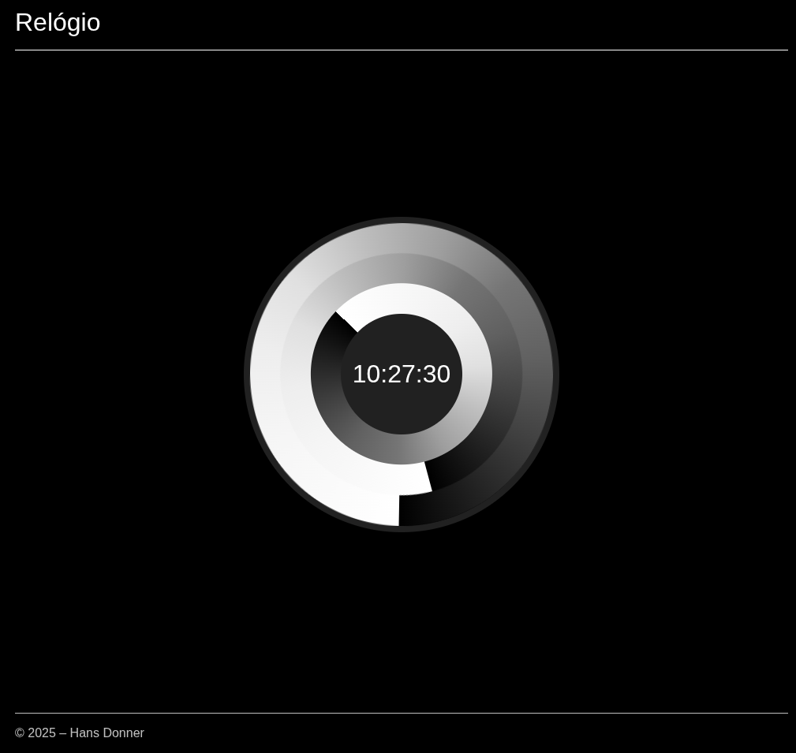
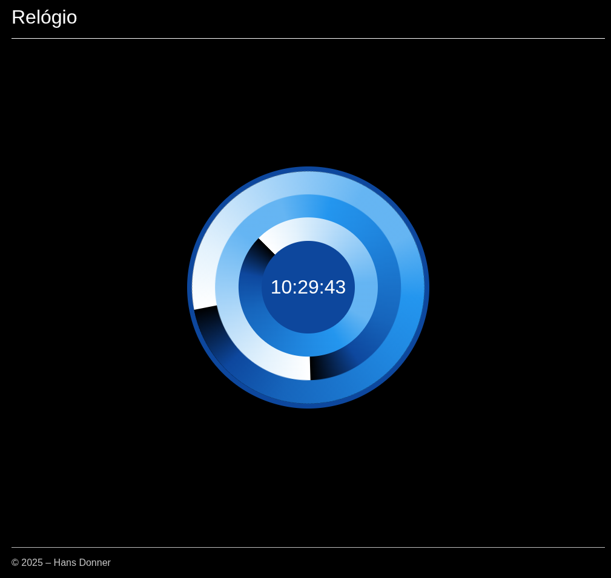
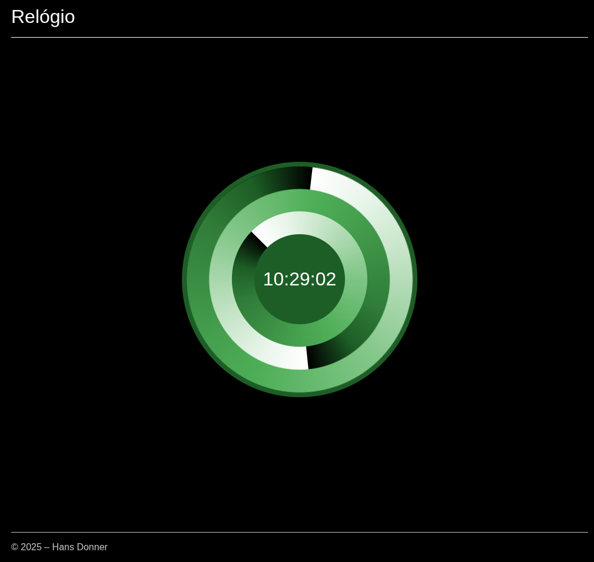
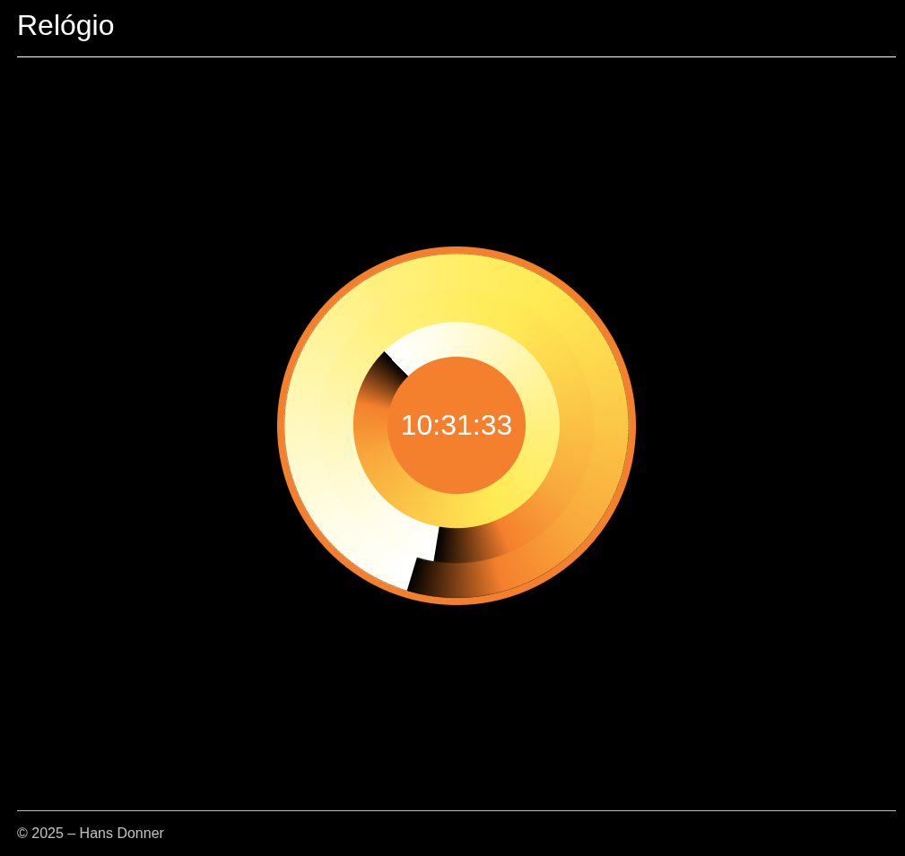
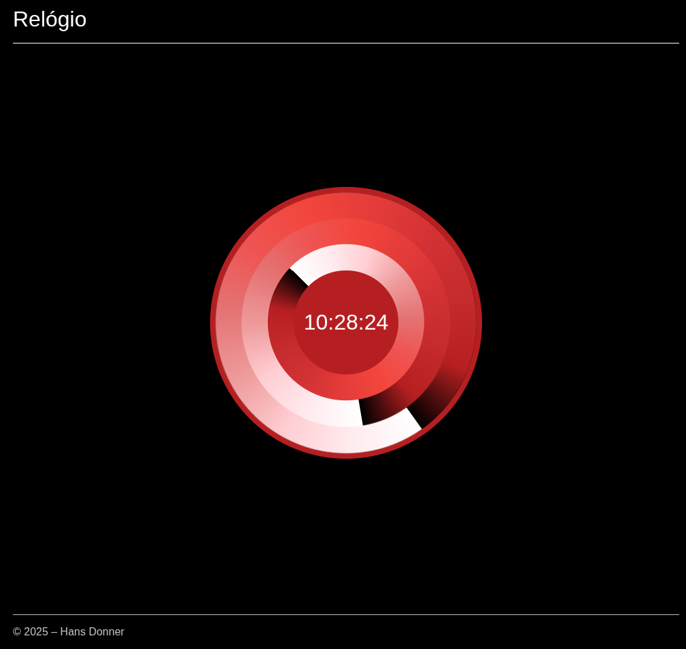

# Timension

um projeto que replica em html, css e javascript o relógio criado por Hans Donner, com opções de cores e mostrador digital.

O "Timension" (ou Time Dimension) de Hans Donner é um conceito de relógio que representa o tempo através de jogos de luzes e combinações de cores, em vez de ponteiros tradicionais. A ideia é mostrar as 43.200 combinações visuais possíveis em um período de 12 horas, com o círculo externo marcando os minutos, o interno os segundos e a área intermediária as horas. O projeto, que nasceu de uma inspiração ligada à rotação da Terra e o escuro, foi transformado em dispositivos digitais e teve como objetivo, segundo Donner, "agregar beleza à interpretação daquilo que nos é tão caro – tempo".

## Origem e Desenvolvimento

- Inspiração: Hans Donner criou o conceito do Time Dimension buscando uma forma mais estética de visualizar a passagem do tempo, ligada à rotação do planeta e à relação entre o sol e o escuro da noite.

- Conceito Visual: Ao invés de ponteiros, o Timension utiliza gradientes de claro-escuro e cores para representar a hora.

- Tecnologia Digital: A criação inicial do conceito levou anos, mas a tecnologia permitiu a sua concretização como um relógio virtual. O termo "Time Dimension" foi concebido para designar essas obras.

## O Conceito de Tempo de Hans Donner

- Belleza e Tempo: Donner quis adicionar beleza à forma como o tempo é interpretado. Ele acredita que o tempo, diferentemente do dinheiro, é vida e merece ser vivido sem pressa.

- Impacto Psicológico: O design do Timension foi pensado para transmitir uma sensação de paz e tranquilidade, ajudando as pessoas a viverem em harmonia com o seu próprio tempo.

## Aplicações do Timension

- Dispositivos Digitais: A tecnologia do Time Dimension foi aplicada em relógios de pulso, de mesa e até como protetor de tela para computadores e dispositivos móveis, como os da Apple.

- Exposições: O conceito também foi apresentado em exposições internacionais, sendo considerado uma obra de vanguarda no design do tempo.

- __Visão geral criada por IA__
